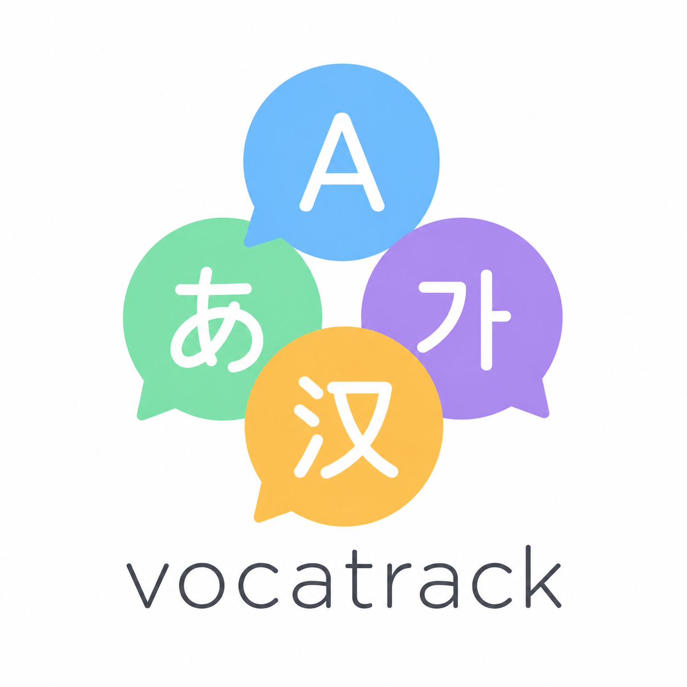

<p align="center">
  
</p>

# vocatrack

Local-first vocabulary tracker with TestYourVocab-style level estimation for English, Japanese, and Korean.

> 한국어: [README.ko.md](./README.ko.md) | 日本語: [README.ja.md](./README.ja.md)

## Install

```text
/plugin marketplace add https://github.com/flame91/vocatrack
/plugin install voca@flame91-voca-marketplace
```

## Quick Start

After installing, run the setup wizard:

```text
/voca setup
```

This walks you through language selection, primary language, scan model, and level test. All other `/voca` commands are blocked until setup is complete.

## Features

| Command | Description |
|---|---|
| `/voca setup` | First-run setup wizard (language, scan model, level test) |
| `/voca add <word>` | Record a word with meaning, example, context, and tags |
| `/voca list` | List recent vocabulary entries in table view |
| `/voca search <q>` | Case-insensitive search across word/meaning/example/context |
| `/voca stats` | At-a-glance dashboard (level, lifecycle, activity, hook precision) |
| `/voca review` | Interactive review of unrated active words |
| `/voca rate <word>` | Rate a word: memorized, learning, or unsure |
| `/voca archive <word>` | Archive a tracked word |
| `/voca master <word>` | Promote a word to mastered |
| `/voca restore <word>` | Restore an archived or mastered word to active |
| `/voca level test [en\|ja\|ko]` | 3-stage adaptive vocabulary size estimate |
| `/voca scan` | Scan session transcript for candidate words (async) |
| `/voca queue` | Picker UI for auto-extracted candidate words |
| `/voca config` | Interactive configuration |
| `/voca domain` | Manage domain tag registry (list / add / remove) |
| `/voca source` | Manage source tag registry (list / add / remove) |
| `/voca reclassify` | Re-tag existing words with current conventions |

The **Stop hook** auto-extracts candidate words from each session by calling Haiku in the background and deduplicating against your existing wordlist.

## Level Assessment

`/voca level test` estimates your vocabulary size through a 3-stage adaptive test, then maps the result to CEFR bands (for L2 learners) or native-speaker reference bands.

### CEFR Bands (all languages)

| Band | Vocab Size | Description |
|---|---|---|
| A1 | < 1,500 | Beginner |
| A2 | < 2,500 | Elementary |
| B1 | < 5,000 | Intermediate |
| B2 | < 8,000 | Upper-intermediate |
| C1 | < 12,000 | Advanced |
| C2 | < 17,000 | Proficient |

### Native-Speaker Bands

| Band | EN | JA | KO |
|---|---|---|---|
| Educated adult | < 25,000 | < 25,000 | < 22,000 |
| Advanced | < 35,000 | < 35,000 | < 30,000 |
| Top tier | < 45,000 | < 45,000 | < 40,000 |
| Heavy reader | < 55,000 | — | — |
| Top 1% | ≥ 55,000 | ≥ 45,000 | ≥ 40,000 |

**Sources**: EN — [testyourvocab.com](http://testyourvocab.com/) 2013 (2M+ participants) · JA — NTT語彙数推定テスト補正版, 阪本 (1955) · KO — 김광해 (2003), 국립국어원 빈도조사 (2002)

## Privacy

The Stop hook calls Anthropic's Haiku API via the local `claude` CLI using your own credentials. Nothing is sent to any third party.

## Environment Variables

| Variable | Default | Purpose |
|---|---|---|
| `VOCA_LOCALE` | System locale (`ko`/`en`/`ja`, fallback `en`) | UI message language for shell scripts |
| `VOCA_STATE_DIR` | `${CLAUDE_PLUGIN_DATA}` if set, else `~/.claude/state` | Where voca.tsv, profile, and config live |
| `VOCA_CONFIG_PATH` | `${VOCA_STATE_DIR}/voca-config.json` | Path to the configuration file |

## Migrating from Legacy Install

The migration script maps old `vocab*` files to new `voca*` names:

```sh
bash ${CLAUDE_PLUGIN_ROOT}/scripts/migrate-from-legacy.sh --dry-run
bash ${CLAUDE_PLUGIN_ROOT}/scripts/migrate-from-legacy.sh
```

## Dependencies

- `bash` 4+, `jq`, `awk`, `sed`, `column`, `python3` (for hook timestamps)
- macOS / Linux / WSL

## Limitations (v0.1.11)

- Shell script outputs are localized (ko/en/ja) via `VOCA_LOCALE`.
- SKILL.md UI strings (AskUserQuestion) support locale-aware rendering via the primary language setting.
- Wordlist updates require `tools/_curate.py` (separate Python venv).

## License

CC BY-SA 4.0 -- see [LICENSE](./LICENSE) and [NOTICE](./NOTICE).
